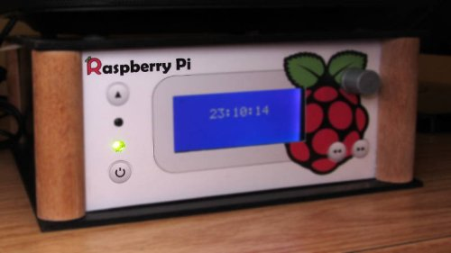

RPIShutdown’s documentation!
============================

RPIShutdown adds a power switch to the Raspberry Pi. So it is possible to completely disconnect the Pi from the electrical power source.

How it works?
-------------

It works in the same way as the power button in the desktop computer will do.

Usually the Raspberry Pi isn’t powered. If the button is pressed, the Raspberry Pi will be started. The next press will smoothly shutdown the PI by running the halt command. If you press the button for about 4 seconds the Raspberry Pi will be hardly shutdown by disconnecting the power.

Contents
--------

License
-------

This project is licensed under **The MIT License (MIT)**. More details will be available in the [license section](license.md).

