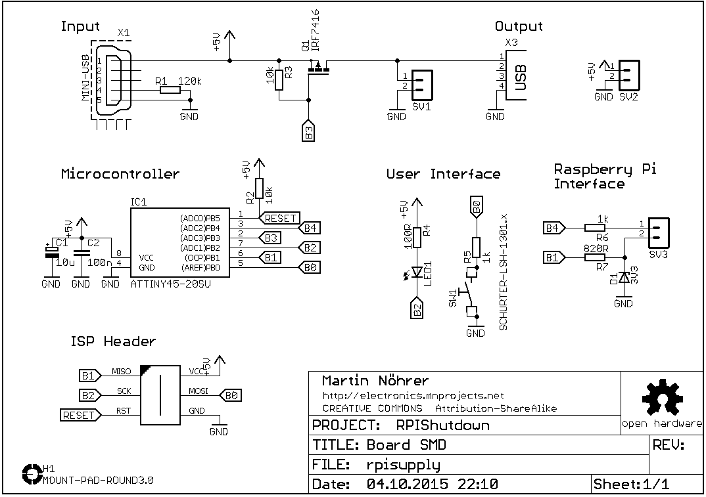

Hardware
========

Schematic
---------

Description
-----------

   
Bill of materials
-----------------

| Qty   | Part    | Device        | Value                 | VID   | Vendor Part Num   |
| ----- | ------- | ------------- | --------------------- | ------- | ----------------- |
| 1     | C1      | Cap pol       | 10u                   | [RE]    | SMD TAN.10/16     |
| 1     | C2      | Cap           | 100n                  | [RE]    | X7R-G0805 100N    |
| 1     | D1      | Zener Diode   | 3V3                   | [RE]    | SMD ZF 3,3        |
| 1     | IC1     | MC            | ATTINY45-20SU         | [RE]    | ATTINY 45-20SU    |
| 1     | LED1    | LED           | green                 | [RE]    | SMD-LED 0805 GN   |
| 1     | Q1      | P-MOSFET      | IRF7416               | [RE]    | IRF 7416          |
| 1     | R1      | RES           | 120k                  | [RE]    | SMD-0805 120K     |
| 2     | R2,R3   | RES           | 10k                   | [RE]    | SMD-0805 10,0K    |
| 1     | R4      | RES           | 100R                  | [RE]    | SMD-0805 100      |
| 2     | R5,R6   | RES           | 1k                    | [RE]    | SMD-0805 1,00K    |
| 1     | R7      | RES           | 820R                  | [RE]    | SMD-0805 820      |
| 1     | SW1     | Switch        | SCHURTER-LSH-1301.x   | [RE]    | TASTER 9319       |
| 1     | X1      | Connector     | MINI-USB              | [RE]    | LUM 2486-01       |
| 1     | X2      | Connector     | AVR-ISP-6-EDGE        | [RE]    | MPE 087-2-006     |
| 1     | X3      | Connector     | USB-A female          | [RE]    | USB AW            |

[RE]: http://www.reichelt.at
  

  
  

Microcontroller Software
========================

State Machine
-------------

Settings
--------

Raspberry PI Software
========================

The Raspberry PI runs a simple script that checks periodically the signal line
of the microcontroller.

The Python script uses the preinstalled GPIO library (Raspbian).
If the microcontroller sends a shutdown command to the Raspberry PI (input line `RPI_RX` goes high)
the script executes the halt command and turn off the Raspberry PI.

Running the shutdown script as a daemon
---------------------------------------

The source folder for the Raspberry PI software also contains a shell script, which is used
to set up the RPIShutdown software as a background daemon.

[Original Script](http://blog.scphillips.com/2013/07/getting-a-python-script-to-run-in-the-background-as-a-service-on-boot/)

