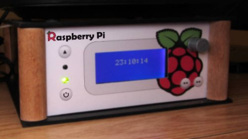

.. RPIShutdown documentation master file, created by
   sphinx-quickstart on Tue Feb 10 13:53:15 2015.
   You can adapt this file completely to your liking, but it should at least
   contain the root `toctree` directive.

RPIShutdown's documentation!
=======================================

RPIShutdown adds a power switch to the Raspberry Pi. So it is possible to completely 
disconnect the Pi from the electrical power source.

How it works?
-------------
It works in the same way as the power button in the desktop computer will do.

Usually the Raspberry Pi isn't powered. If the button is pressed, the Raspberry Pi will be started.
The next press will smoothly shutdown the PI by running the `halt` command.  
If you press the button for about 4 seconds the Raspberry Pi will be hardly shutdown by 
disconnecting the power.

Contents
-----------------

.. toctree::
   :maxdepth: 2

   content/installation-notes
   content/schematic-description
   license

.. 
   Indices and tables
   ==================

   * :ref:`genindex`
   * :ref:`modindex`
   * :ref:`search`

   
License
-------------
This project is licensed under **The MIT License (MIT)**. More details
will be available in the :ref:`license`.

.. _license section: license
